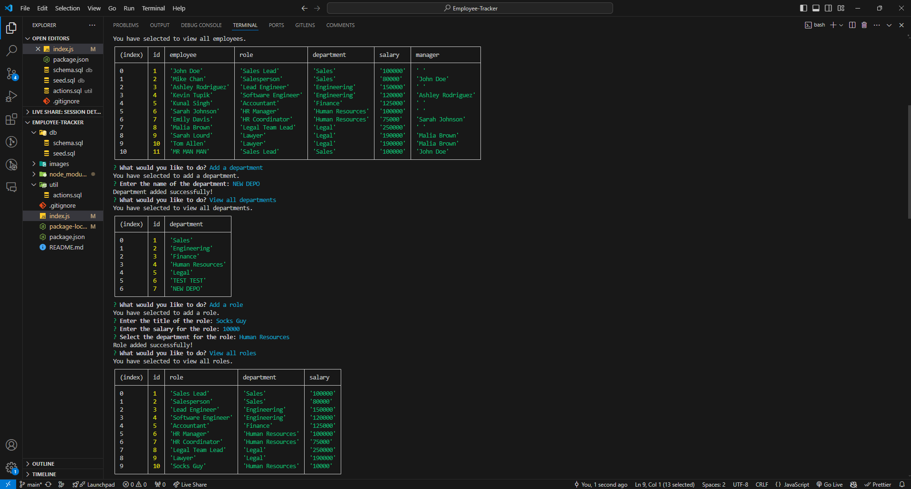

# Employee-Tracker

## Description

This command line application allows companies to organize their roles, employees, and departments all in one spot.
You can also add to the data sets with ease! This was built wtih Node.js, Inquirer, and PostgreSQL.

## Usage

Here is a screenshot of the application in use in VS Code through the integrated terminal:

Here is a walkthrough link showing it in action: 
https://drive.google.com/file/d/1jFdHHJW15uzy-ke2CtWT5q46wM9zRI1G/view?usp=sharing

## Technology Used
- PostgreSQL
- Node.js
- Inquirer

## Credits

If you want to see more of my work or contact me, please visit my GitHub: https://github.com/TheKyleKirby 
